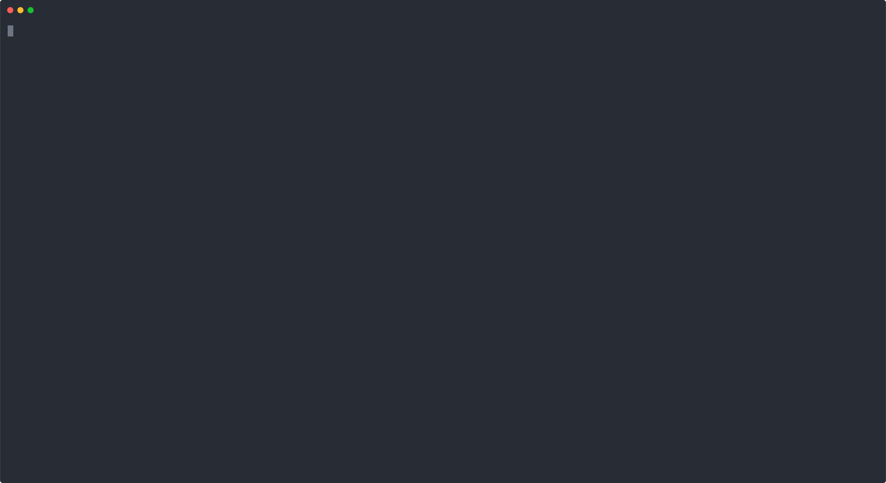

[![Build Status][build-shield]][build-url]
[![Issues][issues-shield]][issues-url]
[![MIT License][license-shield]][license-url]
[![Code Coverage][coverage-shield]][coverage-url]
<p align="center">
  <h3 align="center">cobi</h3>

  <p align="center">
    cobi (cobra Interactive) is a small wrapper on top of <a href="https://github.com/spf13/cobra">cobra</a> and <a href="https://github.com/c-bata/go-prompt">go-prompt</a> to build interactive cli applications
    <br />
    <a href="https://github.com/arjit95/cobi#docs"><strong>Explore the docs »</strong></a>
    <br />
    <br />
    <a href="https://github.com/arjit95/_examples"> Examples </a>
    ·
    <a href="https://github.com/arjit95/cobi/issues">Report Bug</a>
    ·
    <a href="https://github.com/arjit95/cobi/issues">Request Feature</a>
  </p>
</p>

## Table of Contents

* [About the Project](#about-the-project)
* [Overview](#overview)
* [Installing](#installing)
* [Migrating from cobra](#migrating-from-cobra)
* [License](#license)
* [Acknowledgements](#acknowledgements)

## About The Project


Cobra provides a great way to build cli applications whereas go prompt provides powerful interactive prompts. But there are scenarios where the cli application needs to execute a long running task, for eg _port forwarding in kubernetes_. This could be solved with an interactive prompt, whereas normal operations can still work with the default cli application.

## Overview
cobi works by using command completion provided by cobra. These completions are propagated to go prompt providing almost the same experience in both interactive and cli modes.

## Installing
First, use go get to install the latest version of the library. This command will download cobi with all its dependencies:

```bash
go get -u github.com/arjit95/cobi
```

Next, include cobi in your app:

```go
import "github.com/arjit95/cobi"
```

## Migrating from cobra
Suppose you have an existing cobra command:

```go
import "github.com/spf13/cobra"

var cmd = &cobra.Command{
  Use:   "demo",
  Short: "This is a demo cobra command",
  Run: func(cmd *cobra.Command, args []string) {
    // Do Stuff Here
  },
}
```

This would be re-written as

```go
import (
    "github.com/c-bata/go-prompt"
    "github.com/arjit95/cobi"
    "github.com/spf13/cobra"
)

var cmd = &cobi.Command {
    Root: &cobra.Command{
        Use:   "demo",
        Short: "This is a demo cobra command",
        Run: func(cmd *cobra.Command, args []string) {
            // Do Stuff Here
        }, 
    },
    // optional go-prompt options can be passed here
    GoPromptOptions: []prompt.Option{
        prompt.OptionMaxSuggestion(10),
    },
}

// Execute the command normally
cmd.Execute()

// Alternaitvely run the command in interactive mode
// Add an exit command to the shell
cmd.InitDefaultExitCmd()
cmd.RunInteractive()
```

## License
Distributed under the MIT License. See `LICENSE` for more information.

## Acknowledgements
- [cobra](https://github.com/spf13/cobra)
- [go-prompt](https://github.com/c-bata/go-prompt)

[build-shield]: https://travis-ci.com/arjit95/cobi.svg?token=txysNdyEWfPeQ1w6FLcy&branch=main
[build-url]: https://travis-ci.com/arjit95/cobi
[issues-shield]: https://img.shields.io/github/issues/arjit95/vidstream.svg
[issues-url]: https://github.com/arjit95/vidstream/issues
[license-shield]: https://img.shields.io/github/license/arjit95/vidstream.svg
[license-url]: https://github.com/arjit95/vidstream/blob/master/LICENSE
[coverage-shield]: https://codecov.io/gh/arjit95/cobi/branch/main/graph/badge.svg?token=pHyrJjwwAJ
[coverage-url]: https://codecov.io/gh/arjit95/cobi